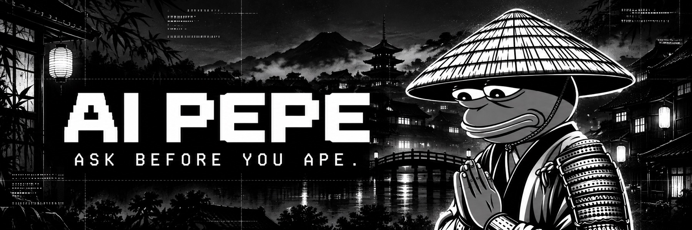
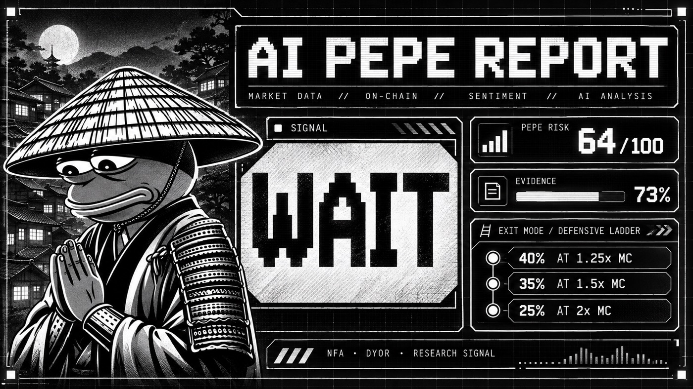
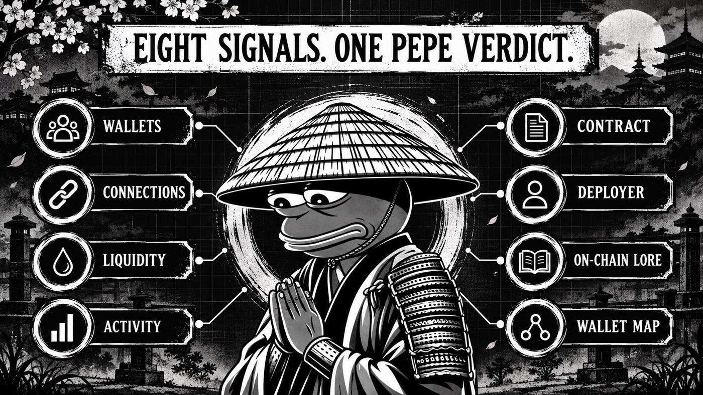

<div align="center">



**Do not ape blind. Ask the Pepe.**

AI-powered token intelligence for Robinhood Chain.

`read-only` · `no wallet connection` · `8 signal groups` · `ronin interface`

### [Open AI PEPE](https://askaipepe.app)

<sub>Experimental research software. Not investment advice.</sub>

</div>

---

## The thirty seconds

1. Open [askaipepe.app](https://askaipepe.app).
2. Paste a Robinhood Chain token contract.
3. Press **Analyze token**.
4. Read the decision signal, evidence and exit scenario before touching the trade.

```text
AI PEPE REPORT
──────────────────────────────────────────────────────────────
  PEPE risk       55 / 100
  decision        BUY SETUP / WAIT / AVOID
  market          cap, liquidity and price context
  wallets         concentration and relationship map
  exit mode       full exit or a market-cap ladder

  every verdict is tied to visible evidence.
```

<div align="center">

</div>

---

## What it is

AI PEPE turns scattered token data into one readable research report.

**An analyzer.** It reads public contract, holder, transfer, launch, liquidity and market data. The site does not ask for a wallet, private key or seed phrase.

**A decision interface.** The result is not buried under charts. AI PEPE puts a large signal at the center of the report:

| Signal | Meaning |
|---|---|
| `BUY SETUP` | Conditions are constructive enough for further research and a defined risk plan. |
| `WAIT` | Evidence is mixed, incomplete or too early. |
| `AVOID` | Critical red flags or weak market structure dominate the setup. |

**A risk plan.** When enough market data exists, the report suggests whether an exit is better handled in full or as a ladder across market-cap levels. These are scenarios, not price forecasts.

---

## The idea

A token page can show price. A block explorer can show transactions. A holder table can show concentration.

The hard part is deciding what those facts mean together.

AI PEPE reduces that work to a visible chain:

```text
contract address
      ↓
public on-chain and market evidence
      ↓
eight signal groups
      ↓
PEPE Risk Score
      ↓
BUY SETUP / WAIT / AVOID
      ↓
exit scenario and evidence trail
```

The score is not a promise that a token will survive. It is a compact reading of the evidence available at analysis time.

---

## Eight signals

<div align="center">

</div>

| Signal group | What Pepe looks for |
|---|---|
| Wallet distribution | Whether a few addresses can control the market. |
| Wallet connections | Visible links between deployer, holders, LP and recent transfers. |
| Liquidity | Whether market depth supports the headline valuation. |
| Recent activity | Transfer count, active addresses and unusual movement. |
| Contract clues | Owner, proxy storage and visible permission patterns. |
| Deployer profile | Launch metadata and the address tied to deployment. |
| On-chain lore | Factual token identity assembled from public metadata. |
| Wallet map | A visual network for inspecting holder relationships. |

A visible connection is a research clue. It is not proof that two wallets share an owner.

---

## The report

The main report keeps the conclusion and the reason in the same view.

| Output | What it tells you |
|---|---|
| PEPE Risk Score | Weighted risk from the evidence that was actually available. |
| Decision signal | The current setup in plain language. |
| Evidence coverage | How much of the intended analysis could be verified. |
| Survival signal | A score-derived heuristic, not a calibrated probability. |
| Market snapshot | Market cap, liquidity, price and indexed pair context. |
| Wallet map | Top holders and recent transfer links. |
| Exit mode | Full exit or laddered risk-management example. |
| Share card | A compact PNG with token artwork, metrics and verdict. |

Missing data is not treated as safe data. When a source cannot answer, the report says so and lowers confidence instead of inventing certainty.

---

## Where the evidence comes from

AI PEPE uses public, read-only sources:

| Source | Purpose |
|---|---|
| Robinhood Chain JSON-RPC | Contract reads, blocks, logs and recent transfers. |
| Pons launch data | Recognized launch and deployer context when available. |
| Dexscreener | Indexed pairs, liquidity, price and market data. |
| DefiLlama | Native asset price context. |
| Blockscout | Explorer links and independent transaction inspection. |

Providers can be delayed, incomplete or unavailable. The interface keeps source gaps visible.

---

## What it refuses to do

AI PEPE is intentionally missing every capability required to move funds.

- No wallet connection.
- No transaction signing.
- No seed phrase or private key input.
- No automatic buying or selling.
- No guaranteed return, target or survival claim.
- No hidden replacement of missing evidence with a positive score.

If any page pretending to be AI PEPE asks for a seed phrase, close it.

---

## Run the interface locally

The repository contains the browser client and the Worker backend used by the project.

```bash
git clone https://github.com/0xPepesso/ai-pepe.git
cd ai-pepe

python3 -m http.server 4173 --directory dist/client
```

Open `http://127.0.0.1:4173` for the demo interface. Live analysis endpoints require the Worker and its D1 binding.

For a Worker deployment, copy the example environment file, create your own D1 database and replace `YOUR_D1_DATABASE_ID` in `backend/wrangler.jsonc`. Never commit real credentials.

```text
ai-pepe/
├── backend/              Worker source, research orchestration and tests
├── db/                   schema source
├── drizzle/              database migration
├── dist/
│   ├── client/           browser interface and Pepe visuals
│   └── server/           deployable Worker bundle
└── assets/               README artwork
```

---

## Verify the research logic

The focused test suite covers decoding, validation, score construction, critical red flags, missing evidence and Worker request handling.

```bash
node --test backend/research.test.mjs
```

The current suite runs without writing to a wallet or submitting a chain transaction.

---

## Honest limits

- A risk score is a research heuristic, not a probability of profit.
- Public indexers can lag or disagree.
- Wallet links show transaction relationships, not identity.
- Contract clues cannot prove what an off-chain team will do.
- Thin markets can move faster than any interface can refresh.
- Exit ladders are illustrative risk-management scenarios, not price predictions.
- Tokens can lose their entire value.

Always verify the contract address and primary evidence yourself.

---

## Security

The public repository intentionally contains no production credentials. Local environment files, deployment metadata and scratch media are ignored by Git.

If you discover a vulnerability, report it privately to the repository owner before publishing technical details. Do not test against other users or attempt to access data that is not yours.

---

<div align="center">

**AI PEPE** · [askaipepe.app](https://askaipepe.app)

<sub>NFA · DYOR · No affiliation with Robinhood Markets, Inc. or PepeCoin.</sub>

</div>
